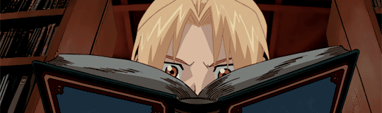
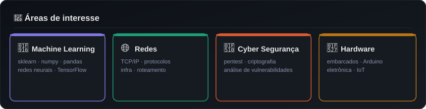

<!-- BANNER -->

  

  
### Seja bem-vindo(a) ao meu GitHub! 👋

`🟢 Ciência da Computação · 7/8 · UNIP`

---

<!-- LINKS -->

  
  
  

 

<!-- BIO -->

### 👾 Sobre mim

Estudante de **Ciência da Computação (7/8 · UNIP)**, apaixonada por tecnologia e seus limites.Atualmente focada em **Machine Learning**, **Redes**, **Cyber Segurança** e **Hardware embarcado**. Gosto de entender como as coisas funcionam por baixo, desde a eletrônica até os algoritmos.

 

---

<!-- TECNOLOGIAS -->
### 💻 Tecnologias que utilizo

  
  
  
  
  
  
  
  
  

 

---

<!-- ÁREAS DE INTERESSE -->

  

 

---

<!-- STATS -->
### 📊 Estatísticas

  
  

  

  

 

---

<!-- FOOTER -->

  

<!--

### Seja bem-vindo(a) ao meu GitHub! 👋

`🟢 Ciência da Computação · 7/8 · UNIP`

---

### 💻 Tecnologias que utilizo

    &nbsp;
    &nbsp;
    &nbsp;
    &nbsp;
    &nbsp;
    &nbsp;
   &nbsp;
    &nbsp;
   

---

### 🧠 Áreas de interesse

<table>
  <tr>
    <td align="center" width="33%">
      <b>🤖 Machine Learning</b> 
      sklearn · numpy · pandas · redes neurais
    </td>
    <td align="center" width="33%">
      <b>🌐 Redes</b> 
      TCP/IP · protocolos · infra · segurança
    </td>
    <td align="center" width="33%">
      <b>🔧 Hardware</b> 
      embarcados · Arduino · eletrônica
    </td>
  </tr>
</table>

---

  

**moniquedmendes/moniquedmendes** is a ✨ _special_ ✨ repository because its `README.md` (this file) appears on your GitHub profile.

Here are some ideas to get you started:

- 🔭 I’m currently working on ...
- 🌱 I’m currently learning ...
- 👯 I’m looking to collaborate on ...
- 🤔 I’m looking for help with ...
- 💬 Ask me about ...
- 📫 How to reach me: ...
- 😄 Pronouns: ...
- ⚡ Fun fact: ...
-->
